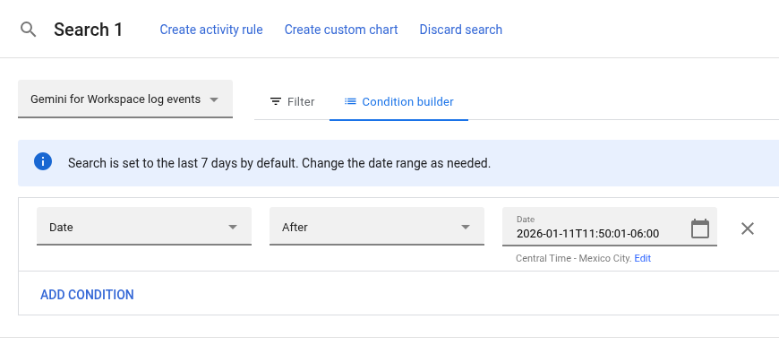
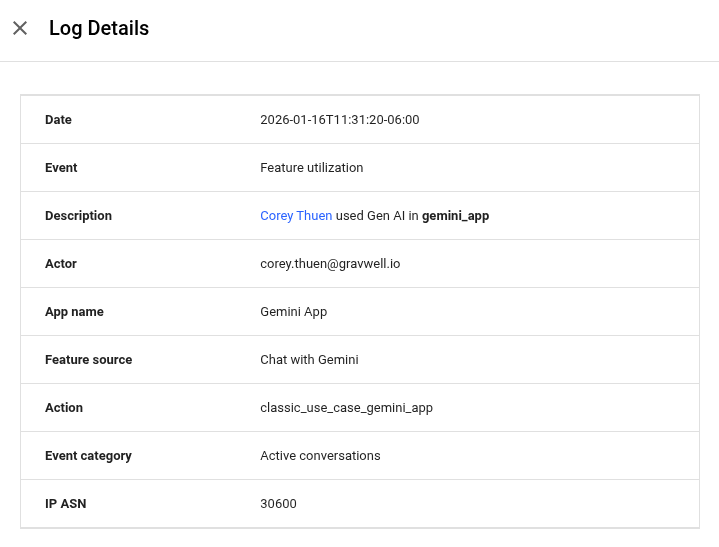
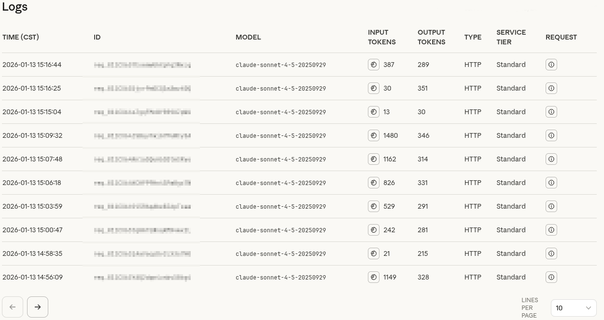

<!-- _class: lead -->
# "Audit" capabilities
## What the vendors actually give you

<!--
The motivating problem for the whole first arc. You've bought AI tools. Something happens. You go to the vendor console for logs. What's actually there?
-->

---

## Not picking on Gemini: it's just an example

Gemini for Workspace log events. Audit search. Seems like it would be a place to look...

<!-- Google Workspace does expose a "Gemini for Workspace log events" search. Great, an audit trail. Let's click into an event and see what a security team actually gets. -->

---

## That's it. That's all you get.

> *Please correct me if I'm wrong. I want to be wrong.*

<!--
Date, actor, app name, "Feature utilization," "classic_use_case_gemini_app." Who and when, maybe. No prompt. No response. No tools. No actions. You cannot run an investigation on this.
-->

---

## Or the provider "logs"

Timestamps, model, <strong>token counts</strong>, HTTP, service tier. Notice what's missing.

<!-- This is the Anthropic console. It's a beautiful invoice. Input tokens, output tokens, model, tier. Zero prompts, zero tool calls, zero actions. Billing-forward, not security-forward. -->

---

## Why the gap exists

- Major providers organize logging **"billing-forward,"** not for cybersecurity
- Many don't support **subkeys** or good key organization
- Those that do organize keys **for billing**, not for security attribution

> You cannot investigate what the vendor never recorded, and they recorded what they need to invoice you, not what you need to know wtf happened.

<!-- Connects back to tokens: they count tokens for money. So we stop asking the vendor and start using our own telemetry. -->

---

## So what can we do *without* more vendor visibility?

> **How do we identify AI usage from the logs we (should) already have?**

- **NDR**: network detection & response (Zeek / Corelight)
- **SDR / EDR**: endpoint (Sysmon)

No vendor cooperation required. Just the telemetry you already collect.

<!-- We don't need Google/OpenAI/Anthropic to hand us anything. DNS, TLS SNI, HTTP, and process-creation events already tell a story. Next: stand up Gravwell and start hunting. -->

---

<!-- _class: lead -->
# Hands-on next
## Stand up Gravwell, then hunt shadow AI

Lab 00 → Lab 02

<!-- Transition to terminal. Everyone SSH in, bring up your Gravwell in docker (Lab 00), then ingest network logs and start finding AI usage (Lab 02). -->
