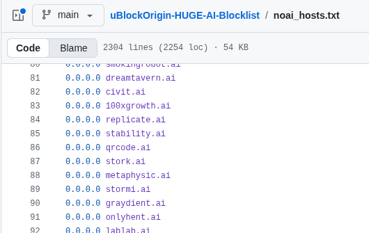
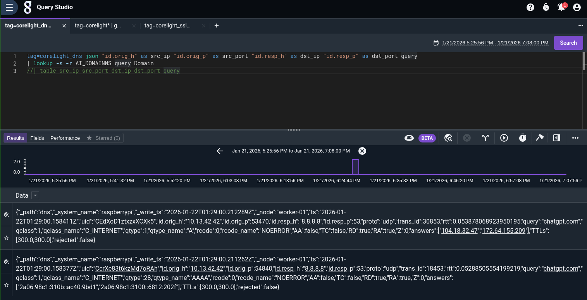
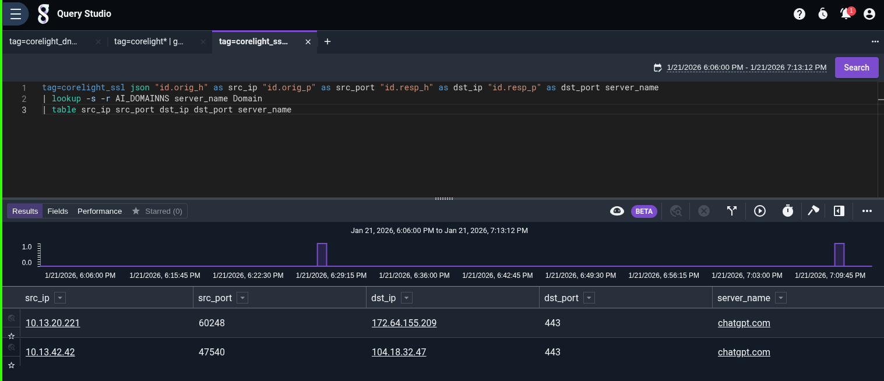
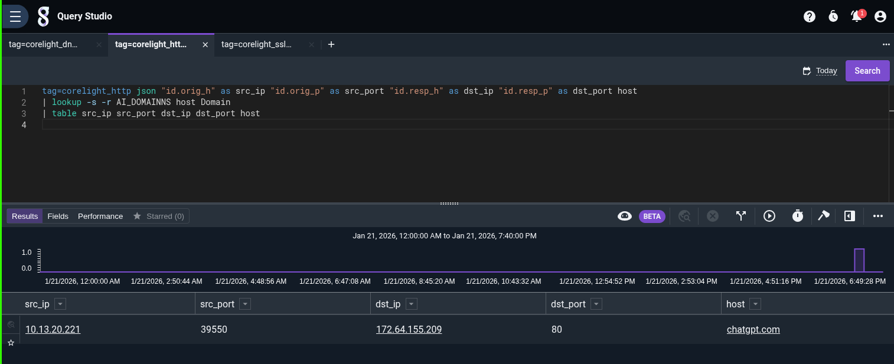

<!-- _class: lead -->
# Hunting shadow AI
## with the logs your org (should) already have

<!--
The vendor won't help us (last section proved that). So we stop asking. Everything from here uses telemetry you already collect: network logs and endpoint logs.
-->

---

## The premise

The providers won't give us security-grade logs.

- Most don't do **subkeys** or real key organization
- The ones that do, do it **for billing**, not attribution

So we identify AI usage from logs we **already should have**:

- **NDR**: network detection & response (Zeek / Corelight)
- **EDR / SDR**: endpoint (Sysmon), *next module*

<!-- None of this needs the vendor's cooperation. It's not perfect, but it's real signal you own. -->

---

## Method 1: DNS

Look for DNS queries to known AI-service domains.

- Needs a maintained **"threatlist"** of AI platform / API / model-provider domains
- It's a **visibility signal, not a control**. Bypassed with proxies, alternate domains, or tunneling
- But it's easy to implement, and it catches the honest majority

<!-- Same idea as alerting on known-bad C2 domains, just pointed at AI. Treat a hit as "worth a look," not proof. -->

---

## Where the domain list comes from



<span class="cap">uBlockOrigin-HUGE-AI-Blocklist / noai_hosts.txt, 2,300+ AI domains</span>

```bash
# strip comments/blanks and the 0.0.0.0 prefix, add a header and it becomes a "csv" lookup table
sed -E '/^\s*#/d; /^\s*$/d; s/^0\.0\.0\.0[[:space:]]+//' noai_hosts.txt \
  | sed '1s/^/Domain\n/' > ai_domains.txt
```

<!-- Community-maintained blocklist repurposed as a lookup table. We load it into Gravwell as the AI_DOMAINS resource. -->

---

## Method 1: the search

```
tag=corelight_dns ax
| lookup -s -r AI_DOMAINS query Domain
| table src_ip src_port dst_ip dst_port query
```

`lookup` keeps only rows whose `query` matches a domain in `AI_DOMAINS`.

<!-- ax = auto-extract JSON fields. The lookup is the filter: DNS names that appear in our AI list survive. -->

---

## Method 1: what you get



<span class="cap">Hosts on 10.13.42.x resolving chatgpt.com, but did they actually *use* it?</span>

<!-- Real result. You can see who queried AI domains. This over-reports: resolving a name isn't using the service. We'll correlate in the lab. -->

---

## Method 2: SSL / TLS

DNS tells you a name was *resolved*. TLS tells you a *connection* was made.

```
tag=corelight_ssl
  json "id.orig_h" as src_ip "id.resp_h" as dst_ip server_name
| lookup -s -r AI_DOMAINS server_name Domain
| table src_ip dst_ip server_name
```

The **SNI `server_name`** is visible even though the payload is encrypted.

<!-- Not much more than DNS on its own, HTTPS hides the URL, but it confirms an actual connection, which is exactly what DNS-only was missing. -->

---

## Method 2: what you get



<span class="cap">corelight_ssl: the SNI gives up the AI hostname even on encrypted traffic</span>

---

## Method 3: HTTP

Plaintext HTTP is rare… right? **You'd be surprised, once we get to MCP.**

```
tag=corelight_http
  json "id.orig_h" as src_ip "id.resp_h" as dst_ip host uri
| lookup -s -r AI_DOMAINS host Domain
| table src_ip dst_ip host uri
```

Also available if you do **TLS inspection**; then you get URLs and bodies, not just the hostname.

<!-- Self-hosted models and a lot of MCP traffic ride plain HTTP. And if you decrypt, HTTP is where the actual prompts show up. -->

---

## Method 3: what you get



<span class="cap">corelight_http: host + URI for AI/MCP endpoints that never bothered with TLS</span>

---

## More avenues (same idea)

- **SSO / auth logs**: Okta / Azure AD / Workspace: users signing into AI apps
- **Browser extensions inventory**: OSQuery, Conceal, etc.
- **Corelight Files**: payloads crossing the wire

> DNS over-reports. SSL confirms a connection. Data fusion is what turns weak signals into strong signals.

<!-- The correlation point is the whole lab: a host that resolves AND connects is real usage; DNS-only is noise. -->

---

<!-- _class: lead -->
# Lab 02
## Ingest the Corelight data, run the hunts, correlate

<span class="muted">`git checkout stage-shadowai -- labs/02-shadow-ai`</span>

<!-- To the terminal. Ingest the four corelight streams into your Gravwell, run these searches, then separate real AI usage from DNS-only noise. -->
