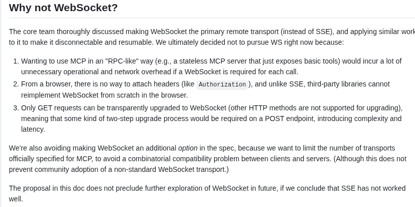

<!-- _class: lead -->
# You down with MCP?
## Yeah, you pwn me

<!--
Model Context Protocol. The main event of the second arc. First understand the protocol, then break it.
-->

---

## What is MCP?

A protocol for **how AI apps integrate with external tools and data**. Before MCP, every tool had its own bespoke calling convention. MCP standardizes it.

- **Host**: the AI application that wants tools
- **Client**: the connection that does the integration
- **Server**: the external tool itself


<!-- Three roles. The LLM never talks to the server directly, the client mediates. Remember that boundary; it matters for the analysis. -->

---

## MCP has had a few… transport phases

Before the schemas, MCP went through a parade of lower-level transports. It's a story.

<!-- Quick history, because it tells you a lot about the maturity (and the security-appliance blind spots) of this ecosystem. -->

---

## Phase 1: stdio

MCP started on **stdin / stdout**. The AI, the user, and the tools all on the same box, piping bytes.

Works as long as everything you're doing is all in the one spot.

<!-- The original transport. No network, no problem. But of course everyone immediately wanted remote tools. -->

---

## Phase 2: HTTP + SSE

*"Boy howdy, wouldn't it be nice to call these remotely?"* → HTTP + **Server-Sent Events**.

- A hacky way to do **two-way** comms over SSE, which SSE was **not designed for**
- Now **deprecated**

*If only there were some way to do two-way communication over a network…*

<!-- SSE is one-directional by design. Bolting bidirectional onto it is exactly as janky as it sounds. This theme repeats. -->

---

## Phase 3: "Streamable HTTP"

Then they invented **streamable HTTP**, because they forgot websockets exist. (And they *definitely* forgot not everything has to be HTTP.)

> In their defense: just about **zero security appliances support websockets.** Ask me how I know.



<!-- The maintainers' own "Why not WebSocket?" writeup. The honest reason is partly the same reason it's hard to inspect: tooling doesn't support WS. Which is also why HTTP-based MCP is inspectable, good for us. -->

---

## The actual protocol: initialize

```json
// client → server
{ "jsonrpc": "2.0", "id": 1, "method": "initialize",
  "params": { "clientInfo": { "name": "example-agent", "version": "1.0.0" },
              "capabilities": { "tools": true, "resources": true, "prompts": true } } }
```
```json
// server → client
{ "jsonrpc": "2.0", "id": 1, "result": {
    "serverInfo": { "name": "log-analysis-mcp", "version": "0.3.2" },
    "capabilities": { "tools": true, "resources": true, "prompts": false } } }
```

<!-- Plain JSON-RPC 2.0. A handshake announcing capabilities. Nothing exotic: which is good, because it means a proxy can read all of it. -->

---

## tools/list: discovery

```json
// client → server
{ "jsonrpc": "2.0", "id": 2, "method": "tools/list" }
```
```json
// server → client
{ "result": { "tools": [ {
    "name": "search_logs",
    "description": "Search log entries with Gravwell!",
    "inputSchema": { "type": "object",
      "properties": { "query": {"type":"string"}, "limit": {"type":"number","default":100} },
      "required": ["query"] } } ] } }
```

The client now exposes `search_logs` as a callable tool. **The description is instructions to the model.** (Are we sensing a common pattern?)

<!-- Tool discovery. The server advertises tools + descriptions. The model reads those descriptions and decides what to call. Lab 06 Part 2 has them write those descriptions themselves and watch what the model does with them; Lab 07 shows one server's manifest steering the model into another server's tools. -->

---

## tools/call: invocation

```json
// client → server
{ "jsonrpc":"2.0","id":3,"method":"tools/call",
  "params": { "name":"search_logs",
              "arguments": { "query":"tag=syslog grep -i error", "limit":20 } } }
```
```json
// server → client
{ "result": { "content": [ { "type":"text",
    "text":"Found 3 matching log entries:\nerror timeout connecting to db\n…" } ] } }
```

<!-- The call and its result. All of it, tools offered, tool chosen, arguments, response, is on the wire in JSON. That's the auditing goldmine. -->

---

## What matters for us

- Tools are **discovered** at runtime. You don't know them ahead of time
- The **LLM never talks to the server directly**. The client does
- It's **JSON-RPC over one endpoint**. Readable, proxyable, loggable

> Everything the model was *offered* and everything it *called* is observable on the wire.

<!-- Set up both the exposure and the defense at once: because it's all inspectable JSON, we can both steer it (Lab 06 Part 2, then Lab 07) and catch it (the ingester, Lab 07 Part 3). Next: Lab 06. -->

---

<!-- _class: lead -->
# Next: Lab 06, MCP deep dive
## Part 1: speak MCP by hand to your own Gravwell · Part 2: write a server and let an agent use it

<!-- Hand-off to Lab 06 (Lab G). Part 1 is curl and JSON-RPC against the seat's own Gravwell MCP server: initialize, tools/list, whoami, one real call. Part 2 is a server from a TOML config, wired into opencode, and the tool-description experiments. After the lab: Lab 07 (tool interaction across servers), whose Part 3 turns what happened into detections. -->
